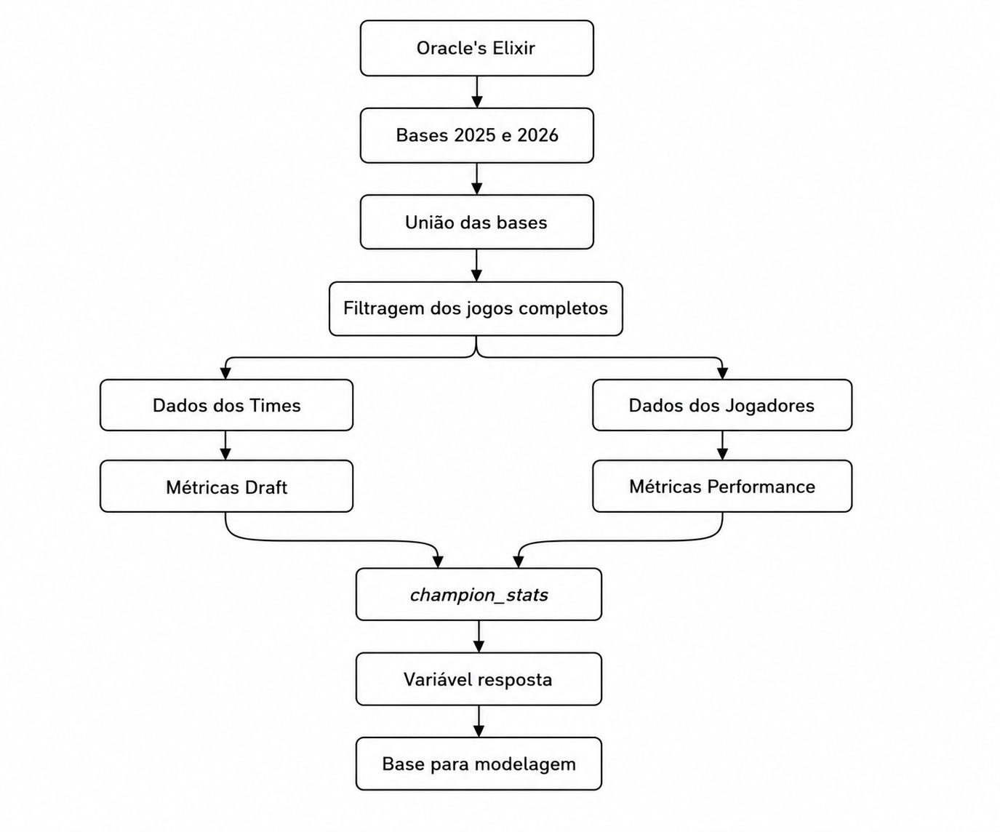
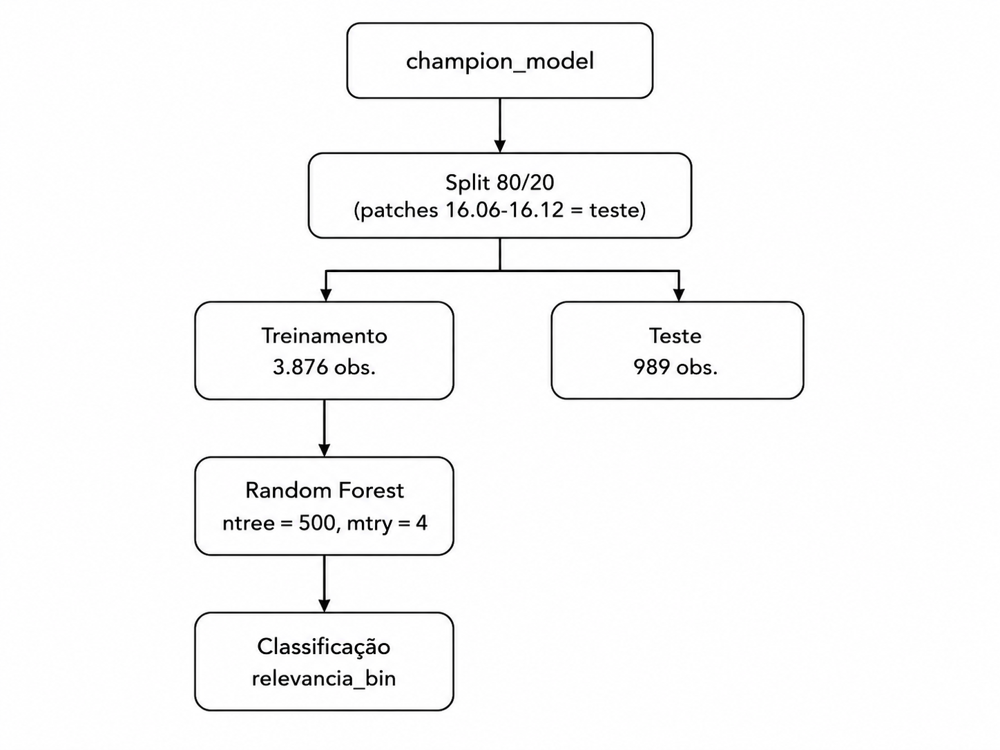

```{r}
#| include: false

# Carrega os pacotes
library(rpart)
library(rpart.plot)
library(tidyverse)
library(knitr)
library(gt)
library(pROC)
library(randomForest)
library(pdp)
#Carrega a base
champion_stats <- read_csv("dados/processed/champion_stats.csv")

#Carrega os graficos e funções
source("scripts/funcoes_graficos.R")
```

## Introdução {#sec-1}

  League of Legends (LoL) é um jogo eletrônico do gênero MOBA (*Multiplayer Online Battle Arena* — "arena de batalha online multijogador"), desenvolvido pela empresa Riot Games e lançado em 2009. Nesse gênero, duas equipes de cinco jogadores se enfrentam em uma única partida, com o objetivo de avançar por um mapa dividido em rotas até destruir a base da equipe adversária, conquistando ao longo do caminho objetivos estratégicos como torres de defesa e monstros neutros que concedem vantagens a quem os elimina.

Cada jogador controla um **campeão** — um personagem jogável com um conjunto próprio de habilidades, atributos de combate e função dentro da equipe. A escolha de quais campeões cada equipe utilizará em uma partida, processo conhecido como draft, é uma decisão estratégica central do jogo, já que campeões diferentes cumprem papéis distintos e se complementam (ou se anulam) de formas específicas.

Dentro de cada equipe, os cinco jogadores assumem posições distintas, cada uma associada a uma função predominante: **Topo (Top)**, que costuma disputar combates isolados em uma das rotas laterais do mapa; **Selva (Jungle)**, responsável por percorrer a área central fora das rotas, eliminando monstros neutros e auxiliando as demais posições; **Meio (Mid)**, posicionado na rota central, com maior influência sobre o restante do mapa; **Atirador (ADC)**, posicionado na rota inferior, responsável por grande parte do dano de longo alcance da equipe ao longo da partida; e **Suporte**, que atua junto ao Atirador oferecendo proteção e controle de grupo, priorizando o crescimento do companheiro de rota em detrimento do próprio. Essa divisão de papéis é relevante para este trabalho porque campeões associados a funções diferentes tendem a apresentar perfis de desempenho estatístico distintos.

A dinâmica competitiva do jogo é influenciada por alterações de balanceamento, estratégias das equipes e desempenho dos campeões. Esses fatores contribuem para a formação do **META** (*Most Effective Tactics Available* — "táticas mais eficazes disponíveis"), o conjunto de campeões e estratégias consideradas mais eficientes em determinado período. O META competitivo é diretamente afetado por atualizações periódicas do jogo, denominadas *patches*, que ajustam o equilíbrio entre os campeões por meio de fortalecimentos (*buffs*), enfraquecimentos (*nerfs*) e revisões mais profundas de suas habilidades (*reworks*).

Para dimensionar a relevância do fenômeno analisado neste trabalho, vale situar alguns números do ecossistema competitivo de League of Legends. Estimativas de terceiros, a Riot Games não divulga esse número oficialmente,  apontam entre 120 e 135 milhões de jogadores ativos mensalmente em 2024-2025 [@levvvel2025riotstats], uma cifra que, segundo rastreadores independentes, colocaria o jogo entre os títulos mais jogados do mundo. No cenário competitivo, a final do Campeonato Mundial de 2025 (Worlds 2025), disputada entre as equipes T1 e KT Rolster, registrou um pico de 6,75 milhões de espectadores simultâneos [@dotesports2025viewership], o maior número entre todos os eventos de esportes eletrônicos daquele ano, com premiação total de US\$ 5 milhões distribuída entre as equipes participantes [@esportsinsider2025prizepool]. Do ponto de vista financeiro, a subsidiária da Riot Games responsável pelas operações fora dos Estados Unidos registrou receita de €1,85 bilhão em 2024 [@irishtimes2025riot], um crescimento de 19% em relação aos € 1,55 bilhão do ano anterior, e a franquia acumula, segundo estimativas do setor, receita superior a US\$ 18,9 bilhões desde seu lançamento em 2009. Esses números evidenciam que o cenário competitivo de League of Legends não constitui um fenômeno de nicho, mas um mercado global de grande escala — o que reforça a relevância prática de estudos voltados à compreensão dos padrões que determinam a relevância competitiva de seus campeões.

  Neste projeto, busca-se identificar quais variáveis do cenário competitivo possuem maior influência na definição dos campeões mais relevantes de um campeonato. Para isso, serão utilizados dados históricos disponibilizados pelo Oracle's Elixir, uma plataforma amplamente utilizada pela comunidade de esports que reúne estatísticas detalhadas de partidas competitivas de League of Legends, com o objetivo de desenvolver modelos de aprendizado de máquina capazes de classificar quais campeões tendem a compor o grupo dos mais relevantes.


**Definindo o Problema:** É possível classificar os campeões mais relevantes do próximo *patch* utilizando apenas informações do cenário competitivo internacional disponibilizadas pelo Oracle's Elixir?

#### Objetivo Geral
  Desenvolver um modelo de classificação baseado em Random Forest capaz de identificar os campeões mais relevantes do campeonato.

#### Objetivo Específicos
* Construir uma base analítica.
* Criar métricas de draft.
* Criar métricas de desempenho.
* Definir uma variável resposta.
* Treinar Random Forest.
* Avaliar desempenho.

## Base de Dados {#sec-2}

  Foi utilizado a base de dados do site [Oracle's Elixir](https://oracleselixir.com/tools/downloads), que disponibiliza em tempo real as estatísticas de partidas reais de todas as ligas do cenário competitivo de LOL. Para esse projeto, foram separados apenas as partidas do ano de 2025 e 2026

Em nosso dataset original, nossas observações eram as partidas por cada jogador e cada time. No entanto, para podermos observar quais variáveis podem ou não ser relevanntes, tornamos os campeões por *patch* como as observações

```{r}
#Tabela com as dimensoes da base
caracterizacao <- tibble(
  Medida = c(
    "Número de observações",
    "Número de variáveis",
    "Número de patches",
    "Número de campeões"
  ),
  Valor = c(
    nrow(champion_stats),
    ncol(champion_stats),
    n_distinct(champion_stats$patch),
    n_distinct(champion_stats$champion)
  )
)

knitr::kable(
  caracterizacao,
  caption = "Dimensão da base de dados")
```
```{r}
#Estrutura da base de dados
knitr::kable(
  champion_stats |>
    select(champion, patch, presence, winrate) |>
    head(),
  caption = "Estrutura da base de dados"
)
```

## Preparação dos Dados {#sec-3}

Antes da modelagem, os dados passaram por um processo de preparação com o objetivo de construir uma base consolidada contendo informações de draft, desempenho dos campeões e variável resposta. As etapas realizadas são apresentadas nas subseções a seguir.

{fig-align="center" width=65%}


### União das Bases {#sec-31}

Os dados utilizados neste trabalho foram obtidos a partir dos arquivos públicos disponibilizados pelo Oracle's Elixir referentes às temporadas competitivas de 2025 e 2026. Inicialmente, ambas as bases foram importadas para o ambiente R e verificou-se que possuíam a mesma estrutura de variáveis. Em seguida, os conjuntos foram unificados em uma única base utilizando a função `bind_rows()`, permitindo ampliar a quantidade de partidas disponíveis para análise.

### Filtragem dos Dados {#sec-32}

Após a união das bases, foram mantidas apenas partidas classificadas como completas, eliminando registros parciais que poderiam comprometer a consistência das análises. Posteriormente, observou-se que algumas variáveis eram exclusivas das linhas correspondentes às equipes, enquanto outras pertenciam apenas aos jogadores. Dessa forma, a base foi dividida em duas estruturas: uma contendo estatísticas das equipes e outra contendo estatísticas individuais dos jogadores. Essa separação permitiu calcular métricas específicas para cada nível de informação.

```{mermaid}
%%{
init: {
  "flowchart": {
    "nodeSpacing": 10,
    "rankSpacing": 36,
    "padding": 0
  },
  "themeVariables": {
    "fontSize": "10px"
  }
}
}%%

flowchart LR
A["Dados completos"] --> B["Somente partidas completas"]
B --> C["Separação"]
C --> D["Time"]
C --> E["Jogadores"]
```

### Construção das Métricas de Draft {#sec-33}

No League of Legends competitivo, antes do início de cada partida ocorre a fase de *draft*, na qual as equipes definem os campeões que serão utilizados durante o jogo. Nessa etapa, os times alternam entre banimentos (*bans*), que impedem a equipe adversária de selecionar determinados campeões, e escolhas (*picks*), nas quais selecionam os campeões que comporão sua equipe. O draft desempenha um papel estratégico fundamental, pois reflete as prioridades das equipes, a força relativa dos campeões em cada atualização (*patch*) e as tendências do META competitivo. Dessa forma, a frequência com que um campeão é escolhido ou banido constitui um importante indicador de sua relevância competitiva.

Com base nessas informações, os dados relacionados ao draft foram utilizados para calcular métricas representativas da utilização competitiva de cada campeão em cada *patch*. Inicialmente, os *picks* e os *bans* foram reorganizados para o formato longo, permitindo contabilizar o número de ocorrências de cada campeão. Em seguida, essas informações foram combinadas com o número total de partidas disputadas em cada *patch* para calcular três métricas principais:

| Métrica   | Descrição                      |
|-----------|:-----------------------------|
| Pick rate |    Proporção de partidas em que o campeão foi escolhido|
| Ban rate  |    Proporção de partidas em que o campeão foi banido|
| Presence  |    Proporção de partidas em que o campeão esteve presente no draft, seja escolha ou banimento|

### Construção das métricas de desempenho {#sec-34}

Como a base de dados está estruturada no nível das partidas, um mesmo campeão pode aparecer diversas vezes dentro de um mesmo *patch*, uma vez que cada ocorrência corresponde ao seu desempenho em uma partida específica. Para que cada observação representasse o desempenho competitivo consolidado de um campeão em determinado *patch*, foi realizada uma etapa de agregação das estatísticas individuais.

| Patch     | Campeão  | Partida  | DPM  | Gold    | KDA  | Vitória |
|-----------|----------|:--------:|:----:|:-------:|:----:|:-------:|
| 15.10     | Ahri     | 1        | 650  | 13.200  | 4,2  | 1       |
| 15.10     | Ahri     | 2        | 610  | 12.800  | 3,8  | 0       |
| ...       | ...      | ...      | ...  | ...     | ...  | ...     |
| 15.10     | Ahri     | 15       | 680  | 13.500  | 4,5  | 1       |

As estatísticas individuais foram agregadas por campeão e *patch*, produzindo uma única observação para cada combinação campeão–patch. Para cada grupo foram calculadas médias de indicadores de desempenho, incluindo ouro obtido, dano por minuto, KDA(Abates + assistência dividos pelo numero de mortes), experiência, objetivos conquistados e taxa de vitória. Esse procedimento reduziu a granularidade dos dados, transformando registros individuais de partidas em indicadores representativos do desempenho competitivo de cada campeão ao longo de cada *patch*.

| Grupo      | Variáveis               |
|------------|-------------------------|
| Economia   | Gold, GPM               |
| Combate    | KDA, DPM                |
| Objetivos  | Torres, dragões, Barões |
| Early Game | Gold@15, XP@15, CS@15   |
| Resultado  | Win rate                |

### Construção da base final {#sec-35}

As métricas de draft e de desempenho foram integradas utilizando o identificador composto pelo campeão e pelo *patch*. Como resultado, obteve-se uma base consolidada denominada `champion_stats`, contendo simultaneamente informações sobre presença competitiva e desempenho em partidas. Essa base constituiu o conjunto de dados utilizado nas etapas seguintes de análise exploratória e modelagem.

$$
Draft Metrics + Performance Metrics = Champion Stats
$$

### Construção da Variável Resposta {#sec-36}

A variável resposta binária, denominada `relevancia_bin`, foi construída a partir da métrica de presença, definida como a proporção de partidas em que um campeão foi escolhido ou banido em determinado *patch*. Essa escolha se justifica por dois motivos: primeiro, a presença sintetiza tanto o valor direto de um campeão (times que optam por utilizá-lo) quanto a ameaça percebida por ele (times que preferem eliminá-lo do draft); segundo, ao contrário da taxa de vitória, a presença não é distorcida pelo comportamento adversarial característico do jogo competitivo profissional, em que campeões efetivamente fortes tendem a ser banidos ou contra-escolhidos, o que tende a aproximar artificialmente sua taxa de vitória de 50%. Para cada *patch*, os campeões foram classificados como "Mais Relevante" (`relevancia_bin = 1`) caso sua presença estivesse no quartil superior (75º percentil) da distribuição daquele *patch*, e "Menos Relevante" (`relevancia_bin = 0`) caso contrário — corte calculado dentro de cada *patch* para controlar por variações no tamanho e na diversidade do meta ao longo do tempo. Por decorrência direta dessa definição, as variáveis `pick_rate`, `ban_rate` e `presence`, utilizadas na construção da resposta, foram excluídas do conjunto de variáveis explicativas do modelo, de modo a evitar circularidade entre resposta e preditores.

| Tipo              | Variáveis                       |
|-------------------|---------------------------------|
| Variável Resposta | relevancia_bin                  |
| Identificador     | champion, patch                 |
| Preditores        | avg_kda, avg_dpm, avg_gold, etc |


## Análise Exploratória {#sec-4}

### Caracterização da base {#sec-41}

Após o processo de preparação, a base final passou a conter uma observação para cada combinação entre campeão e *patch*, reunindo informações de draft e desempenho competitivo. Essa estrutura reduz a granularidade dos dados originais e fornece um conjunto adequado para o treinamento de modelos de classificação.

A base final resultante do processo de preparação contém 5.124 observações, cada uma representando a combinação entre um campeão e um *patch*, distribuídas ao longo de 172 campeões e 36 *patches* distintos, e descritas por 34 variáveis, entre identificadoras, métricas de draft, métricas de desempenho e a variável resposta.

```{r}
caracteriza <- tibble(
  Medida = c("Número de observações", "Número de variáveis",
             "Número de patches", "Número de campeões"),
  Valor = c(nrow(champion_stats), ncol(champion_stats),
            n_distinct(champion_stats$patch), n_distinct(champion_stats$champion))
)

knitr::kable(caracterizacao, caption = "Caracterização da base final")
```

### Valores Ausentes {#sec-42}

A base apresenta 259 observações (5,1%) com valores ausentes, decorrentes majoritariamente de campeões banidos mas nunca escolhidos em determinado *patch* — situação em que não há partidas jogadas das quais extrair métricas de desempenho. Essas observações foram excluídas antes da etapa de modelagem.

### Estatísticas descritivas {#sec-43}

Observa-se que as variáveis apresentam escalas bastante distintas. Enquanto a variável `winrate` assume valores confinados entre 0 e 1, a variável `avg_gold` varia entre 4.494 e 25.578 — uma amplitude de mais de 21 mil unidades. Essa diferença de escala não representa problema para o algoritmo Random Forest, uma vez que esse modelo baseia-se em divisões sucessivas dos dados (não em distâncias ou combinações lineares entre variáveis), sendo portanto invariante à padronização das variáveis.

```{r}
#| label: tbl-estatisticas
#| tbl-cap: "Estatísticas descritivas das principais variáveis"

estatisticas <- champion_stats %>%
  summarise(
    across(
      c(winrate, avg_kda, avg_gold, avg_dpm, presence, n_games),
      list(
        Média = ~mean(.x, na.rm = TRUE),
        Mediana = ~median(.x, na.rm = TRUE),
        DP = ~sd(.x, na.rm = TRUE),
        Mínimo = ~min(.x, na.rm = TRUE),
        Máximo = ~max(.x, na.rm = TRUE)
      )
    )
  ) %>%
  pivot_longer(
    everything(),
    names_to = c("Variavel", "Estatistica"),
    names_sep = "_(?=[^_]+$)",
    values_to = "Valor"
  ) %>%
  pivot_wider(
    names_from = Estatistica,
    values_from = Valor
  )

knitr::kable(estatisticas, digits = 2)
```

### Distribuição de presence {#sec-44}

A @fig-presence apresenta a distribuição da variável `presence`. Observa-se uma distribuição fortemente assimétrica à direita (coeficiente de assimetria ≈ 1,59): a mediana (0,053) é bem inferior à média (0,139), evidenciando que a maior parte dos campeões possui baixa presença competitiva, enquanto uma parcela reduzida concentra os valores mais elevados (até 0,96). Esse comportamento reforça a existência de um grupo relativamente pequeno de campeões que domina o meta competitivo em cada *patch*.

```{r}
#| label: fig-presence
#| fig-cap: "Distribuição da variável presence"

plot_presence_hist(champion_stats)
```

### Distribuição da classe {#sec-45}

A variável resposta foi construída utilizando o percentil de 75% da presença dentro de cada *patch*, produzindo duas classes: 74,5% "Menos Relevante" e 25,4% "Mais Relevante". A @fig-relevancia confirma essa proporção esperada pela própria definição do corte, com pequenos desvios decorrentes de empates na distribuição de presença em alguns *patches*.

```{r}
#| label: fig-relevancia
#| fig-cap: "Distribuição da classe relevancia_bin"

plot_classe_bar(champion_stats)
```

### Relação entre presence e as variáveis explicativas {#sec-46}

Para viabilizar a leitura, a relação entre `presence` e as variáveis explicativas foi analisada em três grupos temáticos: variáveis econômicas/farm, variáveis de combate, e variáveis de controle de objetivos.

#### Relação entre presence e as variáveis explicativas, por posição {#sec-461}

Com a inclusão da variável `position` na base, utilizada exclusivamente para fins exploratórios, não como preditora do modelo, é possível investigar se os padrões observados nos gráficos de dispersão refletem diferenças entre as funções exercidas pelos campeões durante a partida.

```{r}
#| label: fig-presence-posicao
#| fig-cap: "Distribuição da presença por posição"

plot_presence_por_posicao(champion_stats)
```

A @fig-presence-posicao mostra diferenças relevantes na presença mediana entre posições: Atirador (ADC) apresenta a maior presença mediana (0,087), seguido por Meio (0,074), Topo (0,053), Suporte (0,044) e Selva (Jungle), com a menor mediana (0,026). Essa diferença pode refletir a profundidade do pool de campeões competitivamente viáveis em cada função — se a Selva possui mais opções viáveis simultaneamente, a presença tende a se distribuir entre mais campeões, reduzindo a presença mediana de cada um individualmente, enquanto o Atirador, com um *pool*(conjunto de campeões nos quais um jogador possui proficiência suficiente para utilizá-los de forma competitiva) historicamente mais restrito, concentra presença em menos campeões.

```{r}
#| label: fig-presence-economia
#| fig-cap: "Relação entre presence e variáveis econômicas/farm, por posição"
#| fig-width: 7
#| fig-height: 4

vars_economia <- c("avg_gold", "avg_xp15", "avg_cspm")

plot_presence_scatter_facet(champion_stats, vars_economia)
```

A @fig-presence-economia confirma, com dado real, o que antes era apenas hipótese: há separação nítida por posição nas variáveis econômicas. `avg_cspm` mediano varia de 1,06 (Suporte) a 9,19 (ADC), e `avg_gold` mediano de 8.256 (Suporte) a 14.476 (ADC) — um reflexo direto do papel de cada função na distribuição de recursos da partida. Apesar dessa separação clara, a relação entre essas variáveis e `presence` permanece fraca **dentro de cada posição** (correlações entre -0,21 e 0,07), indicando que a posição explica a dispersão dos valores das variáveis econômicas, mas não isoladamente a presença competitiva dos campeões.

```{r}
#| label: fig-presence-combate
#| fig-cap: "Relação entre presence e variáveis de combate, por posição"
#| fig-width: 7
#| fig-height: 4

vars_combate <- c("avg_kda", "avg_firstblood", "winrate")

plot_presence_scatter_facet(champion_stats, vars_combate)
```

Nas variáveis de combate ( @fig-presence-combate), a separação visual por posição é menos marcante que nas econômicas, e as correlações com `presence` permanecem baixas em todas as posições (ex.: `avg_kda` variando entre -0,01 e 0,15 conforme a posição).


```{r}
#| label: fig-presence-objetivos
#| fig-cap: "Relação entre presence e variáveis de controle de objetivos"
#| fig-width: 8
#| fig-height: 6

vars_objetivos <- c("avg_firstdragon", "avg_firsttower", "avg_void_grubs", "avg_barons", "avg_elders")

plot_presence_scatter_facet(champion_stats, vars_objetivos)
```

Já para as variáveis de controle de objetivos (@fig-presence-objetivos), chama atenção que, apesar da relação linear também ser fraca aqui (ex.: correlação de -0,004 entre `presence` e `avg_firstdragon`), essas foram justamente as variáveis com maior importância no modelo de Random Forest ajustado posteriormente (`avg_firstdragon`: 39,9; `avg_barons`: 34,7 de MeanDecreaseAccuracy). Essa aparente contradição será retomada na Seção 4.7, e sugere que a relação entre controle de objetivos e relevância competitiva emerge de combinações não lineares entre variáveis, não de um efeito linear isolado.

Diferente das variáveis econômicas, as métricas de controle de objetivos (@fig-presence-objetivos) não mostram separação clara por posição. Isso é esperado: como discutido na Seção 3.4, essas variáveis são estatísticas do time inteiro, replicadas igualmente para os cinco campeões da equipe em cada partida — não refletem, portanto, uma ação atribuível a uma função específica.

### Correlação {#sec-47}

Observa-se que a correlação
linear é fraca em toda a base, não ultrapassando 0,069 em módulo mesmo para a variável mais correlacionada (`avg_kda`, r = 0,069). Esse resultado, já
sugerido pelos gráficos de dispersão da Seção 4.6, é confirmado de forma
sistemática: nenhuma variável, isoladamente, apresenta associação linear
relevante com a relevância competitiva dos campeões, incluindo
`avg_firstdragon` (r = -0,004) e `avg_barons` (r = 0,046), que se revelarão entre as mais importantes no modelo de Random Forest. Essa dissociação entre correlação linear fraca e importância preditiva elevada reforça a adequação de um modelo não linear, capaz de capturar combinações e interações entre variáveis, em vez de efeitos isolados.

```{r}
#| label: fig-correlacao-economia
#| fig-cap: "Correlação entre as variáveis econômicas/farm"
#| fig-width: 6
#| fig-height: 5

var_economia <- c("avg_gold", "avg_gpm", "avg_dpm", "avg_xp15","avg_goldat15", "avg_csat15", "avg_cspm")

plot_corr_heatmap(champion_stats,var_economia)
```

A @fig-correlacao-economia isola as sete variáveis de natureza
econômica e revela multicolinearidade acentuada entre elas: `avg_csat15` e
`avg_cspm` apresentam correlação de 0,978, `avg_goldat15` e `avg_gpm` de 0,904, `avg_gold` e `avg_gpm` de 0,895, e `avg_gpm` e `avg_cspm` de 0,892 — quatro entre vários pares acima de 0,80. Esse resultado é esperado, já que essas variáveis capturam, em essência, a mesma dimensão de desempenho (a capacidade de acumular recursos ao longo da partida), medida em diferentes momentos ou unidades. Para o Random Forest, essa redundância não compromete a capacidade preditiva do modelo, mas dilui a importância atribuída a cada variável individualmente entre as correlatas.

```{r}
#| label: fig-correlacao-combate-objetivos
#| fig-cap: "Correlação entre variáveis de combate e de controle de objetivos"
#| fig-width: 8
#| fig-height: 7

vars_combate_objetivos <- c(vars_combate, "avg_firstdragon", "avg_firsttower", "avg_towers", "avg_void_grubs","avg_barons", "avg_infernals", "avg_mountains", "avg_clouds","avg_oceans", "avg_chemtechs", "avg_hextechs", "avg_elders")

plot_corr_heatmap(champion_stats, vars_combate_objetivos)
```

A @fig-correlacao-combate-objetivos isola as variáveis de combate e de controle de objetivos, revelando um agrupamento de correlações elevadas em torno de winrate: com `avg_towers` (r = 0,888), `avg_kda` (r = 0,613) e `avg_barons` (r = 0,580); e entre `avg_towers` e `avg_barons` (r = 0,653). Diferentemente das correlações econômicas discutidas anteriormente, essas associações decorrem em grande parte da própria mecânica do jogo — equipes vencedoras tendem a acumular mais objetivos e KDAs mais favoráveis ao longo da partida como consequência natural de estarem à frente no confronto, não porque a conquista desses objetivos "cause" a vitória de forma independente. Essa relação deve, portanto, ser interpretada com cautela, evitando-se atribuir-lhe um significado causal: trata-se, em grande medida, de diferentes formas de medir o mesmo desfecho — o quanto a equipe estava vencendo a partida.

### Evolução Temporal {#sec-48}

```{r}
#| label: fig-evolucao-temporal
#| fig-cap: "Evolução da presença média dos campeões por patch"
#| fig-width: 8
#| fig-height: 4

plot_evolucao_temporal(champion_stats)
```

A @fig-evolucao-temporal apresenta a evolução da presença média dos campeões ao longo dos *patches* analisados. A presença média mantém-se relativamente estável, entre 0,12 e 0,15, na maior parte dos *patches*. Observam-se, contudo, picos nos *patches* 15.20 a 15.24 (até 0,255) e no *patch* 16.12 (0,196) — coincidindo exatamente com os *patches* identificados anteriormente (Seção 3) como tendo volume reduzido de partidas, provavelmente associados a etapas finais de temporada com menor número de ligas representadas. Esse resultado reforça a interpretação de que tais *patches* constituem períodos atípicos, com estimativas menos estáveis em razão do tamanho de amostra reduzido.

### Síntese {#sec-49}

A análise exploratória revelou que a presença competitiva dos campeões segue uma distribuição assimétrica, concentrada em um grupo relativamente pequeno de campeões de alta relevância. As correlações lineares entre presença e as variáveis de desempenho individuais mostraram-se fracas, mesmo para variáveis que se revelaram importantes no modelo preditivo, sugerindo que a relevância competitiva resulta de combinações complexas entre múltiplos fatores, não de características isoladas. Adicionalmente, identificou-se instabilidade nas estimativas de presença em *patches* associados a etapas finais de temporada, com menor volume de dados. Esses resultados reforçam a adequação do Random Forest como técnica de modelagem, dada sua capacidade de capturar relações não lineares e interações entre variáveis.

## Modelagem {#sec-5}

### Definição do problema de classificação {#sec-51}

O objetivo desta etapa é desenvolver um modelo capaz de classificar os campeões entre duas categorias: "Mais Relevante" e "Menos Relevante". Para isso, foi utilizada a variável `relevancia_bin`, construída durante a preparação dos dados a partir do percentil de 75% da variável `presence` em cada *patch*. Conforme apresentado na Seção 3, para cada *patch* foi calculado o terceiro quartil da distribuição de presence; campeões cuja presença foi igual ou superior a esse limite receberam o valor 1, enquanto os demais receberam 0.

A escolha do percentil de 75% como limiar de corte foi submetida a uma checagem de robustez por meio de validação cruzada (k = 5), restrita ao conjunto de treinamento e sem qualquer contato com o conjunto de teste,
comparando-a contra os percentis 80% e 85%.

```{r}
#| label: tbl-corte-cv
#| tbl-cap: "AUC médio por percentil de corte, via validação cruzada (k = 5)"

resultados_percentil <- purrr::map_dfr(c(0.75, 0.80, 0.85), avaliar_corte_cv)
knitr::kable(resultados_percentil, digits = 3)
```

O corte de 75% apresentou o maior AUC médio entre as três alternativas testadas (0,945, contra 0,928 e 0,908, respectivamente), com queda monotônica de desempenho conforme o corte se torna mais restritivo, padrão consistente com a redução do tamanho da classe positiva disponível para treinamento em cada dobra. Esse resultado reforça, com evidência empírica, a adequação do percentil de 75% já adotado por convenção na literatura de tier lists competitivas, sendo portanto o percentil mantido para a construção da variável resposta utilizada no restante deste trabalho.

### Variáveis utilizadas no modelo {#sec-52}

| Grupo             | Variáveis                                      |
|-------------------|------------------------------------------------|
| Desempenho geral  | winrate, avg_kda, avg_dpm, avg_gpm             |
| Enconomia         | avg_gold, avg_goldat15                         |
| Farm/Experiência  | avg_csat15, avg_cspm, avg_xp15                 |
| Primeiro evento   | avg_firstblood, avg_firstdragon, avg_firsttower|
| Objetivos         | 	avg_towers, avg_barons, avg_void_grubs, avg_infernals, avg_mountains, avg_clouds, avg_oceans, avg_chemtechs, avg_hextechs, avg_elders |
| Contexto temporal | patch |

As variáveis utilizadas como preditoras foram selecionadas a partir das
métricas de desempenho e controle de objetivos construídas durante a preparação dos dados (@sec-3) e caracterizadas na análise exploratória (@sec-4). Variáveis diretamente relacionadas à definição da variável resposta — `presence`, `pick_rate`, `ban_rate`, bem como as contagens que as originam (`n_picks, n_bans, n_presence_games, total_games`) e o limiar de corte (`corte`) — não foram utilizadas como preditoras, de modo a evitar que o modelo recebesse informações que já determinam, por construção, o próprio rótulo que se deseja prever. A variável position, incorporada posteriormente à base para fins exploratórios (@sec-46), também não foi utilizada como preditora, uma vez que sua função foi investigar diferenças descritivas entre funções exercidas pelos campeões, não integrar o modelo preditivo.

### Separação entre treinamento e teste {#sec-53}

Para avaliar a capacidade de generalização do modelo, os dados foram
divididos em dois subconjuntos: treinamento e teste. Em uma primeira tentativa, adotou-se como conjunto de teste um único *patch* (**16.10**), o último *patch* da base com volume de partidas comparável ao restante da temporada, conforme discutido na @sec-3. Essa abordagem, no entanto, resultou em um conjunto de teste pequeno (160 observações, das quais apenas 40 pertencentes à classe "Mais Relevante"), produzindo estimativas de sensibilidade e precisão com variabilidade elevada. Optou-se, portanto, por uma divisão alternativa: os sete *patches* finais da base (**16.06** a **16.12**) foram reservados para teste, e os *patches* restantes para treinamento, resultando em uma proporção de aproximadamente 80% para treinamento (3.876 observações) e 20% para teste (989 observações, das quais 261 pertencentes à classe "Mais Relevante") — proporção próxima da divisão convencional 80/20 utilizada em problemas de classificação.

| Conjunto     | Observações | Proporção | Classe "Mais Relevante" |
|--------------|-------------|-----------|--------------------------|
| Treinamento  | 3.876       | 79,7%     | —                        |
| Teste        | 989         | 20,3%     | 261                      |

: Divisão dos dados em treinamento e teste {#tbl-split}

### Random Forest {#sec-54}

Para realizar a classificação dos campeões, foi utilizado o algoritmo Random Forest. O método consiste na combinação de múltiplas árvores de decisão, cada uma construída a partir de uma amostra bootstrap dos dados de treinamento e de um subconjunto aleatório das variáveis explicativas disponíveis em cada divisão de nó. A classificação final de cada observação é obtida por voto majoritário entre as árvores da floresta.

A escolha do Random Forest está relacionada à natureza dos dados analisados, que reúnem variáveis de desempenho potencialmente correlacionadas entre si (conforme evidenciado na @sec-47) e cuja relação com a variável resposta não se mostrou linear (@sec-46 e @sec-47). Além disso, o método permite avaliar a importância relativa de cada variável na classificação, o que é particularmente relevante para este trabalho: o objetivo não é apenas prever a relevância competitiva dos campeões, mas identificar quais características de desempenho estão associadas a ela. A análise da importância das variáveis é apresentada na @sec-6.

```{r}
#| label: fig-arvore-exemplo
#| fig-cap: "Exemplo ilustrativo de árvore de decisão (simplificada)"
#| fig-width: 5
#| fig-height: 3

arvore_exemplo <- rpart(
  update(formula_modelo, factor(relevancia_bin) ~ . - patch),
  data = treino_y,
  method = "class",
  maxdepth = 3,
  cp = 0.01
)

rpart.plot(arvore_exemplo, type = 2, extra = 104, fallen.leaves = TRUE)
```

A @fig-arvore-exemplo apresenta uma árvore de decisão simplificada, ajustada de forma independente ao conjunto de treinamento apenas para fins ilustrativos, com profundidade limitada a três níveis. É importante destacar que essa árvore não corresponde a nenhuma das 500 árvores que compõem o modelo de Random Forest final: cada uma delas é ajustada a uma amostra bootstrap distinta e a um subconjunto aleatório de variáveis, e a classificação final resulta do voto conjunto entre todas elas, não da lógica de uma única árvore isolada. A figura tem como único objetivo ilustrar o mecanismo geral de divisões sucessivas dos dados que fundamenta o método.

### Configuração do modelo {#sec-55}

O modelo foi configurado com 500 árvores (*ntree* = 500), buscando fornecer uma quantidade suficiente de árvores para estabilizar as previsões do ensemble sem custo computacional excessivo. Em cada divisão de nó, 4 variáveis foram consideradas como candidatas ao corte (*mtry* = 4), valor definido automaticamente pelo pacote randomForest como a raiz quadrada do número total de preditoras — configuração padrão recomendada para problemas de classificação.

### Treinamento {#sec-56}

{fig-align="center" width=60%}

O Random Forest foi ajustado utilizando exclusivamente o conjunto de treinamento. Cada uma das 500 árvores foi construída a partir de uma amostra bootstrap distinta dos dados de treinamento e de um subconjunto aleatório de 4 variáveis candidatas em cada divisão de nó. Após o ajuste, o modelo foi aplicado ao conjunto de teste, mantido completamente separado durante o treinamento, permitindo avaliar sua capacidade de generalização a observações não utilizadas no ajuste — resultados apresentados na Seção 6.

## Avaliação do Modelo {#sec-6}

Após o treinamento do modelo Random Forest, seu desempenho foi avaliado utilizando o conjunto de teste, composto por observações que não participaram do processo de treinamento. A avaliação foi realizada por meio da matriz de confusão e de métricas de classificação, permitindo analisar diferentes aspectos do desempenho do modelo, como a capacidade de identificar corretamente campeões relevantes e não relevantes. Os resultados apresentados nesta seção referem-se ao modelo ajustado com a divisão treino/teste de 80/20 (@sec-53), adotada como estratégia final após a comparação detalhada na Seção 6.5.

### Matriz de Confusão {#sec-61}

$$
\begin{array}{c|cc}
& \multicolumn{2}{c}{\text{Real}} \\
\text{Predito} & 0 & 1 \\ \hline
0 & 583 & 35 \\ 
1 & 145 & 226
\end{array}
$$

A matriz de confusão permite comparar as classes reais dos campeões com as classes previstas pelo modelo. Os verdadeiros positivos (VP = 226) correspondem aos campeões classificados corretamente como relevantes, enquanto os verdadeiros negativos (VN = 583) correspondem aos campeões corretamente classificados como não relevantes. Os falsos positivos (FP = 145) representam campeões classificados como relevantes pelo modelo, mas que pertencem à classe não relevante, enquanto os falsos negativos (FN = 35) correspondem aos campeões relevantes que não foram identificados pelo modelo.

### Métricas de desempenho {#sec-62}

```{r}
#| label: tbl-metricas
#| tbl-cap: "Métricas de desempenho do modelo final no conjunto de teste"

tibble::tibble(
  Métrica = c("Acurácia", "Sensibilidade", "Especificidade", "Precisão", "F1-score"),
  Valor = c(acuracia_y, sensibilidade_y, especificidade_y, precisao_y, f1_y)
) %>%
  knitr::kable(digits = 3)
```

A acurácia representa a proporção de classificações realizadas corretamente pelo modelo considerando ambas as classes. A sensibilidade mede a capacidade de identificar corretamente os campeões classificados como relevantes, enquanto a especificidade representa a capacidade de identificar corretamente os campeões não relevantes. A precisão indica, entre os campeões classificados pelo modelo como relevantes, a proporção que de fato pertence à classe relevante. Por fim, o F1-score combina precisão e sensibilidade em uma única medida.

O modelo apresentou acurácia de 81,8%, indicando que cerca de oito em cada dez classificações realizadas no conjunto de teste foram corretas. A sensibilidade de 86,6% demonstra boa capacidade de identificar campeões classificados como relevantes, enquanto a especificidade de 80,1% indica desempenho satisfatório na identificação dos campeões não relevantes. A precisão de 60,9% indica que parte considerável dos campeões classificados como relevantes pelo modelo não pertencia, de fato, à classe relevante — um padrão já esperado dado o desbalanceamento da variável resposta (@sec-45). O F1-score de 0,715 fornece uma medida conjunta entre precisão e sensibilidade, indicando um equilíbrio razoável entre a identificação dos campeões relevantes e a quantidade de classificações positivas incorretas.

### Por que não olhar somente para a acurácia? {#sec-63}

A acurácia, isoladamente, não é suficiente para avaliar o desempenho do modelo, pois considera conjuntamente as duas classes e pode ocultar diferenças na capacidade de classificação de cada uma delas, especialmente relevante neste trabalho, dado que a classe "Mais Relevante" representa apenas 25,4% da base (@sec-45). Por esse motivo, foram analisadas adicionalmente métricas como sensibilidade, especificidade, precisão e F1-score.

### Curva ROC {#sec-64}

```{r}
#| label: fig-roc
#| fig-cap: "Curva ROC do modelo Random Forest final (conjunto de teste)"

roc_rf_y <- roc(response = teste_y$relevancia_bin, predictor = prob_rf_y)

plot(roc_rf_y,
     main = "Curva ROC — Random Forest (conjunto de teste, split 80/20)",
     xlab = "1 - Especificidade", ylab = "Sensibilidade")
```

A curva ROC foi utilizada para avaliar a capacidade do modelo de distinguir
entre campeões relevantes e não relevantes considerando diferentes pontos de
corte para a classificação. A área sob a curva (AUC) resume esse
comportamento em uma única medida: o modelo final obteve AUC de 0,906 no
conjunto de teste, valor classificado como excelente segundo as referências
usuais da literatura (AUC > 0,90), indicando forte capacidade discriminativa
entre as duas classes ao longo de todos os possíveis pontos de corte, não
apenas no limiar padrão de 50% utilizado nas métricas da @sec-62.

Observa-se que o AUC no conjunto de teste (0,906) é ligeiramente inferior ao
AUC médio obtido na validação cruzada durante a checagem do percentil de
corte (0,945, @sec-51). Essa diferença é esperada: enquanto a validação
cruzada foi realizada inteiramente dentro do período de treinamento, o
conjunto de teste corresponde a *patches* temporalmente posteriores (16.06 a
16.12), nunca vistos pelo modelo durante o ajuste ou a validação. A queda
modesta observada é consistente com uma avaliação temporalmente honesta,
refletendo o desafio real de generalizar para um período de META futuro.

### Comparação dos modelos {#sec-65}

```{r}
#| label: tbl-comparacao-oob
#| tbl-cap: "Erro OOB no treinamento — comparação entre divisões"

tibble::tibble(
  Métrica = c("Erro OOB geral", "Erro OOB - classe 0", "Erro OOB - classe 1"),
  `Modelo 1 (patch único)` = c("11,37%", "6,83%", "23,75%"),
  `Modelo 2 (80/20)` = c("11,20%", "6,14%", "24,95%")
) %>%
  knitr::kable()
```

```{r}
#| label: tbl-comparacao-teste
#| tbl-cap: "Desempenho no conjunto de teste — comparação entre divisões"

tibble::tibble(
  Métrica = c("Acurácia", "Especificidade", "Precisão", "F1-score", "Sensibilidade"),
  `Modelo 1` = c("79,4%", "72,5%", "54,8%", "0,707", "100%"),
  `Modelo 2` = c("81,8%", "80,1%", "60,9%", "0,715", "86,6%"),
  Variação = c("+2,4 p.p.", "+7,6 p.p.", "+6,1 p.p.", "+0,008", "-13,4 p.p.")
) %>%
  knitr::kable()
```

O erro OOB (out-of-bag) durante o treinamento foi praticamente idêntico entre as duas divisões (11,37% no Modelo 1 contra 11,20% no Modelo 2, uma diferença de apenas 0,17 ponto percentual), indicando que o Random Forest encontrou padrões semelhantes em ambas as bases de treino, a escolha da divisão não alterou substancialmente o que o modelo aprendeu, apenas o conjunto em que essa aprendizagem foi avaliada.

A diferença relevante aparece no conjunto de teste. O Modelo 1, avaliado apenas no *patch* 16.10 (160 observações, 40 delas da classe "Mais Relevante"), obteve sensibilidade de 100% o modelo acertou todos os campeões relevantes daquele *patch*, mas à custa de uma precisão de apenas 54,8%. Dado o tamanho reduzido dessa amostra de teste, essa sensibilidade perfeita está sujeita a variabilidade elevada: um único falso negativo a mais já a reduziria para 97,5%, o que limita a confiabilidade dessa estimativa isolada.

O Modelo 2, avaliado num conjunto de teste maior (989 observações, 261 da classe "Mais Relevante"), apresentou acurácia, especificidade, precisão e F1-score superiores ao Modelo 1, com uma redução esperada na sensibilidade (de 100% para 86,6%), redução aceitável e mesmo desejável, uma vez que a sensibilidade perfeita do primeiro modelo refletia, em boa parte, o tamanho reduzido de sua amostra de teste, não uma capacidade de generalização superior. A utilização de um conjunto de teste maior e mais representativo fornece, portanto, uma avaliação mais confiável do desempenho real do Random Forest.

Diante desses resultados, optou-se por adotar o Modelo 2 (divisão 80/20, *patches* 16.06 a 16.12 como teste) como modelo final para as análises subsequentes, por apresentar desempenho mais equilibrado entre as métricas e uma estratégia de avaliação mais robusta.

### Resumo da Avaliação {#sec-66}

De maneira geral, os resultados indicam que o Random Forest apresentou capacidade satisfatória para classificar os campeões entre relevantes e não relevantes. Embora o modelo apresente maior capacidade de identificação dos campeões relevantes do que de precisão das classificações positivas, o conjunto das métricas indica um desempenho equilibrado. A análise das variáveis responsáveis por essas classificações é apresentada na seção seguinte, buscando compreender quais características dos campeões possuem maior contribuição para as previsões realizadas pelo modelo.

## Interpretação do Resultados {#sec-7}

Após a avaliação do desempenho preditivo do Random Forest, esta seção busca interpretar os resultados obtidos pelo modelo e identificar quais variáveis apresentaram maior contribuição para a classificação dos campeões como relevantes ou não relevantes. A interpretação é realizada principalmente por meio da análise da importância das variáveis e dos efeitos das principais variáveis sobre as previsões do modelo, com base no modelo final (@sec-53, divisão 80/20).

### Importância das Variáveis {#sec-71}

| Rank | Modelo X (patch único) | Valor X | Modelo Y (80/20, final) | Valor Y |
|---:|---|---:|---|---:|
| 1 | `avg_elders` | 51,9 | `avg_elders` | 49,3 |
| 2 | `avg_firstdragon` | 39,9 | `avg_firstdragon` | 37,4 |
| 3 | `avg_firsttower` | 38,8 | `avg_firsttower` | 37,1 |
| 4 | `avg_barons` | 34,7 | `avg_mountains` | 35,2 |
| 5 | `avg_infernals` | 34,3 | `winrate` | 33,3 |
| ... | (bloco de objetivos) | 33–34 | (bloco de objetivos) | 28–31 |
| 9 | `winrate` | 31,9 | `avg_towers` | 26,9 |
| 14 | `avg_kda` | 17,4 | `avg_kda` | 19,2 |
| 18 | `patch` | 15,8 | `patch` | 15,0 |
| último | `avg_dpm` | 13,1 | `avg_gold` | 13,6 |

: Importância das variáveis em cada modelo {#tbl-imp}

A importância das variáveis foi analisada com o objetivo de identificar quais características apresentaram maior contribuição para as decisões realizadas pelo Random Forest, utilizando a importância por permutação (MeanDecreaseAccuracy), menos suscetível ao viés de variáveis com muitos níveis, relevante dado que *patch* integra o modelo com dezenas de categorias.

Conforme apresentado na @tbl-imp, as variáveis com maior importância no **Modelo Y** foram `avg_elders`, `avg_firstdragon` e `avg_firsttower`, seguidas por `avg_mountains` e `winrate`. As variáveis de natureza econômica (`avg_gold, avg_gpm, avg_dpm, avg_xp15, avg_goldat15, avg_csat15, avg_cspm`) apresentaram, em conjunto, a menor contribuição entre todas as variáveis do modelo.

### Interpretação das principais variáveis {#sec-72}

As três variáveis de maior importância, `avg_elders, avg_firstdragon e avg_firsttower`, mantiveram exatamente essa mesma ordem também no modelo preliminar ajustado com a divisão de teste por *patch* único, apesar das duas divisões utilizarem conjuntos de treinamento parcialmente distintos. Essa consistência reforça que a predominância de variáveis relacionadas ao controle de objetivos não é um artefato de uma divisão específica dos dados.

Esse resultado, no entanto, requer uma ressalva importante. `avg_elders, avg_firstdragon, avg_firsttower` e as demais variáveis de objetivo (dragões por tipo, barões, torres) são estatísticas do time inteiro, replicadas igualmente para os cinco campeões da equipe em cada partida, não correspondem a uma conquista atribuível ao campeão individualmente (@sec-34). Dessa forma, a interpretação "campeões que controlam objetivos são mais relevantes" deve ser lida com cautela: é possível que o modelo esteja capturando, em parte, um confundidor de força de equipe: Campeões relevantes tendem a ser escolhidos justamente pelas equipes mais fortes e disciplinadas, que também são as que dominam objetivos de forma consistente, independentemente de qual campeão jogam.

Um caso específico ilustra esse cuidado: `avg_elders`, a variável de maior importância em ambos os modelos, está associada a partidas que já se estenderam consideravelmente (o Dragão Ancião só surge após a captura de quatro dragões anteriores). Assim, essa variável pode estar capturando indiretamente a tendência de um campeão aparecer em partidas mais longas e disputadas, e não uma característica do campeão em si.

Um resultado mais tranquilizador: *patch* não figura entre as variáveis mais importantes em nenhum dos dois modelos (18ª colocação em X, 20ª em Y), indicando que o modelo não está simplesmente memorizando em qual *patch* cada campeão apareceu, mas aprendendo padrões que se sustentam entre diferentes períodos competitivos.

Vale destacar ainda a subida de `winrate` entre os dois modelos (9ª posição em X, para 5ª em Y), no modelo final, o desempenho em vitórias aproxima-se mais do bloco de maior importância do que no modelo exploratório inicial, sugerindo que essa variável se torna mais informativa quando o modelo é treinado com um período histórico mais amplo.

### Relação entre as principais variáveis e relevância (PDPs) {#sec-73}

```{r}
#| label: fig-pdp
#| fig-cap: "Dependência parcial das principais variáveis sobre a probabilidade de relevância"
#| fig-width: 8
#| fig-height: 6


plot_pdp_grid(modelo_rf_y, treino_y, c("avg_elders", "avg_firsttower", "winrate", "avg_kda"))
``` 

Para complementar a análise da importância das variáveis, foram utilizados gráficos de dependência parcial (PDPs), que permitem observar a direção e o formato da relação entre cada variável e a probabilidade estimada de um campeão ser classificado como "Mais Relevante", mantendo as demais variáveis em seus valores médios.

### Interpretação dos PDPs {#sec-74}

Os gráficos de dependência parcial indicam relações não lineares entre as variáveis analisadas e a probabilidade estimada de relevância. Entre as variáveis apresentadas, `avg_firsttower`, `avg_kda` e winrate apresentam comportamento semelhante, com aumento da probabilidade estimada em intervalos intermediários e posterior redução para valores mais elevados. Destaca-se ainda o comportamento de `winrate`, cuja maior probabilidade estimada ocorre aproximadamente entre 50% e 55%, resultado consistente com o padrão identificado na análise exploratória. Já `avg_elders` apresenta comportamento mais irregular, com uma variação acentuada em valores muito baixos e posterior estabilização.

### Relação com a análise exploratória {#sec-75}

Os resultados obtidos pelo modelo dialogam diretamente com os padrões identificados na análise exploratória (@sec-4). A Seção 4.7 já havia mostrado que a correlação linear entre presence e as variáveis explicativas individuais era fraca em toda a base, inferior a 0,07 em módulo mesmo para `avg_firstdragon` e `avg_barons`, que se confirmaram, na modelagem, entre as variáveis de maior importância. Essa dissociação, antecipada na análise exploratória, reforça que a relação entre desempenho em jogo e relevância competitiva não é de natureza linear, mas emerge de combinações entre múltiplas variáveis, exatamente o tipo de padrão que o Random Forest é capaz de capturar e que uma análise de correlação simples não revelaria.

O predomínio das variáveis de controle de objetivos também é consistente com a Seção 4.7, na qual já havia sido observado um agrupamento de correlações elevadas entre `winrate`, `avg_towers` e `avg_barons`, interpretado, à época, como reflexo da própria mecânica do jogo (equipes vencedoras tendem a acumular mais objetivos). A modelagem reforça essa mesma cautela interpretativa: a importância elevada dessas variáveis pode refletir, em parte, força de equipe, e não uma característica intrínseca dos campeões avaliados.

### Síntese dos Resultados {#sec-76}

Considerando os resultados obtidos, observa-se que as informações disponíveis na base do [Oracle's Elixir](https://oracleselixir.com/tools/downloads) permitem construir um modelo capaz de classificar os campeões de acordo com a definição de relevância adotada neste trabalho. O Random Forest final apresentou AUC de 0,906 e acurácia de 81,8% no conjunto de teste, indicando boa capacidade de distinção entre as classes "Mais Relevante" e "Menos Relevante". A análise de importância das variáveis indicou que características relacionadas ao controle de objetivos estruturais e de dragões (em especial `avg_elders, avg_firstdragon e avg_firsttower`) apresentaram a maior contribuição para essa classificação, resultado consistente entre as duas divisões de treino/teste avaliadas neste trabalho (@sec-65), ainda que sujeito à ressalva de que tais variáveis refletem desempenho coletivo da equipe, não exclusivamente do campeão. Em contrapartida, variáveis de desempenho econômico individual (ouro, dano por minuto, farm) apresentaram a menor contribuição relativa entre as variáveis analisadas, resultado que, embora inicialmente contraintuitivo, mostrou-se robusto entre os dois modelos ajustados.

## Limitações {#sec-8}

Apesar dos resultados obtidos indicarem que o Random Forest apresentou capacidade satisfatória de classificação, algumas limitações devem ser consideradas na interpretação dos resultados. Essas limitações estão relacionadas principalmente à definição da variável resposta, à natureza das variáveis utilizadas, à abrangência da base de dados e à estratégia de avaliação adotada.

### Definição da relevância {#sec-81}

A primeira limitação está relacionada à própria definição da variável resposta. Neste trabalho, um campeão foi considerado "Mais Relevante" quando sua presença se encontrava no quartil superior da distribuição de presence dentro de cada *patch*. Embora esse procedimento permita adaptar o critério às características de cada período e reduzir o efeito das diferenças na distribuição do META, o ponto de corte de 75% é uma escolha metodológica e não representa uma definição universal de relevância competitiva. Consequentemente, alterações no percentual utilizado como ponto de corte poderiam produzir classificações diferentes e, potencialmente, modificar o desempenho e a interpretação do modelo.

### Influência da força das equipes {#sec-82}

Outra limitação está relacionada às variáveis de controle de objetivos. As métricas `avg_elders, avg_firstdragon, avg_firsttower, avg_barons` e outras variáveis semelhantes representam acontecimentos ocorridos durante as partidas e estão fortemente relacionados ao desempenho coletivo das equipes. Embora essas informações sejam associadas aos campeões presentes nas partidas e possam contribuir para a classificação, elas não representam exclusivamente características individuais dos campeões.

Dessa forma, a elevada importância atribuída pelo modelo às variáveis relacionadas a objetivos não deve ser interpretada diretamente como evidência de que determinados campeões são mais relevantes por sua capacidade individual de controlar esses objetivos. Parte dessa associação pode refletir a força das equipes que utilizam esses campeões.

### Abrangência das informações utilizadas {#sec-83}

A base utilizada contempla exclusivamente informações provenientes das partidas do cenário competitivo de League of Legends. Dessa forma, fatores externos ao desempenho observado nas partidas não foram incorporados ao modelo.

Fatores tais como:

- alterações de balanceamento;
- buffs e nerfs;
- reworks;
- mudanças específicas de *patch*;
- estatísticas de SoloQ (modo de jogo ranqueado);
- mudanças no sistema do jogo;
- estratégias adotadas pelas equipes;
- contexto competitivo.

Assim, embora o *patch* tenha sido incorporado como variável explicativa, o modelo não recebe informações explícitas sobre quais campeões sofreram alterações de balanceamento em cada atualização. Duas situações com estatísticas semelhantes nas partidas podem, portanto, apresentar contextos de jogo diferentes que não são diretamente representados pelas variáveis utilizadas.

### Generalização para outros cenários {#sec-84}

A capacidade de generalização do modelo também constitui uma limitação. Os dados analisados correspondem ao cenário competitivo profissional disponível nas temporadas de 2025 e 2026, não sendo possível assumir que os padrões identificados sejam igualmente válidos para partidas ranqueadas ou períodos diferentes.

Além disso, o META é dinâmico e pode sofrer alterações significativas ao longo do tempo. Portanto, um modelo ajustado com dados históricos pode apresentar redução de desempenho quando aplicado a períodos futuros com características distintas das observadas na amostra utilizada.

### Estratégia de divisão dos dados {#sec-85}

Por fim, embora a divisão final entre treinamento e teste tenha sido realizada de forma temporal, utilizando *patches* distintos para avaliação, o conjunto de teste ainda pertence ao mesmo período geral de desenvolvimento da base. Dessa forma, a avaliação fornece evidências sobre a capacidade de generalização dentro do período estudado, mas não garante que o modelo mantenha o mesmo desempenho em novos ciclos competitivos ou em alterações futuras do META.

Vale ressaltar que as limitações apresentadas não invalidam os resultados obtidos, mas delimitam o alcance das conclusões. Os resultados devem ser interpretados como evidências sobre a classificação da relevância dos campeões dentro do contexto competitivo e do período analisado, considerando a definição de relevância adotada e as variáveis disponíveis na base do Oracle's Elixir. Estudos futuros poderiam ampliar a análise incorporando informações sobre alterações de balanceamento, dados de SoloQ, características das equipes e métodos de validação temporal mais amplos.


## Conclusão {#sec-9}

Este trabalho teve como objetivo responder à pergunta formulada na introdução: é possível classificar os campeões mais relevantes do cenário competitivo de League of Legends utilizando apenas informações disponibilizadas pelo Oracle's Elixir? Os resultados obtidos indicam uma resposta afirmativa: o modelo de Random Forest ajustado foi capaz de distinguir, com desempenho satisfatório, campeões classificados como "Mais Relevante" e "Menos Relevante" a partir exclusivamente de métricas de draft e desempenho competitivo, sem depender de julgamento externo ou de conhecimento prévio sobre o META vigente.

Para chegar a esse resultado, os dados de partidas competitivas de 2025 e 2026 foram unificados, filtrados e reorganizados de uma granularidade por partida/jogador para uma granularidade por campeão e *patch* (@sec-3), resultando na base `champion_stats`. A variável resposta (`relevancia_bin`) foi construída a partir do quartil superior da presença de cada campeão dentro de seu *patch*, escolha justificada tanto conceitualmente quanto por validação cruzada, que confirmou o percentil de 75% como superior às alternativas de 80% e 85% testadas (@sec-51). A análise exploratória (@sec-4) revelou que a relação entre presença e as variáveis de desempenho é predominantemente não linear, e a modelagem foi conduzida com um Random Forest treinado sobre uma divisão temporal 80/20 (@sec-53), com o percentil de corte e a estratégia de divisão dos dados validados antes da avaliação final.

Os resultados encontrados mostraram um modelo com boa capacidade discriminativa: AUC de 0,906 e acurácia de 81,8% no conjunto de teste (@sec-6), com desempenho consistente entre as duas divisões treino/teste avaliadas ao longo do trabalho. A análise de importância das variáveis (@sec-71) indicou que características relacionadas ao controle de objetivos, em especial `avg_elders`, `avg_firstdragon` e `avg_firsttower`, apresentaram a maior contribuição para a classificação, num resultado que se manteve estável entre os dois modelos ajustados, enquanto variáveis de desempenho econômico individual (ouro, dano por minuto, farm) mostraram-se consistentemente as menos relevantes, um achado inicialmente contraintuitivo, mas robusto.

Considerando o conjunto desses resultados, o modelo pode ser considerado adequado para o problema proposto: apresentou capacidade discriminativa excelente segundo os critérios usuais de AUC, sensibilidade satisfatória na identificação de campeões relevantes (86,6%) e desempenho equilibrado nas demais métricas. A precisão mais modesta (60,9%) não invalida essa adequação, mas reflete o desafio inerente de classificar uma classe minoritária (25,4% da base) e aponta para uma direção específica de aprimoramento, discutida adiante.

Por outro lado, os resultados devem ser interpretados à luz das limitações apresentadas na @sec-8, em especial, a possibilidade de que a importância elevada das variáveis de objetivo reflita, em parte, um confundidor de força de equipe (@sec-82), e o fato de que fatores externos às partidas, como alterações explícitas de balanceamento entre *patches*, não estão representados nas variáveis utilizadas (@sec-83). Essas limitações não invalidam as conclusões obtidas, mas delimitam seu alcance: os resultados devem ser lidos como evidência da relação entre desempenho competitivo observado e relevância no draft, dentro do período e da definição de relevância adotados, não como uma relação causal estabelecida entre características individuais dos campeões e seu sucesso competitivo.

### Trabalhos Futuros {#sec-91}

A partir das limitações identificadas, alguns caminhos concretos poderiam aprimorar este trabalho em estudos futuros:

- Ajuste do limiar de decisão. Como discutido na @sec-64, o AUC elevado (0,906) contrasta com a precisão mais modesta obtida no limiar padrão de 50%, sugerindo que um ponto de corte otimizado para o desbalanceamento das classes (não explorado neste trabalho) poderia melhorar o equilíbrio entre precisão e sensibilidade sem alterar o modelo em si.
- Controle pela força das equipes. Incorporar uma medida do desempenho geral da equipe (por exemplo, sua taxa de vitória histórica) como variável de controle permitiria isolar, com mais precisão, a contribuição específica do campeão da contribuição do time que o utiliza, respondendo diretamente à limitação discutida na @sec-82.
- Incorporação de dados de balanceamento e de SoloQ. A inclusão de informações explícitas sobre alterações de *patch* (quais campeões foram alvo de buffs, nerfs ou reworks) e de estatísticas do modo ranqueado (SoloQ) permitiria diferenciar mudanças de relevância motivadas por balanceamento daquelas motivadas por adaptação estratégica das equipes (@sec-83).

## Referências 
::: {#refs}
:::
